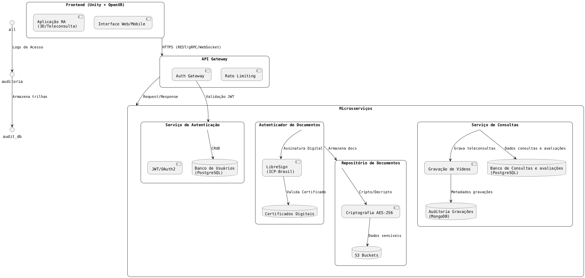
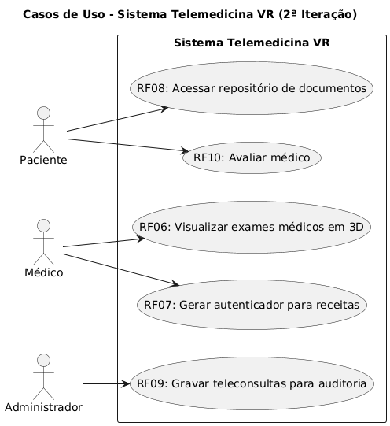
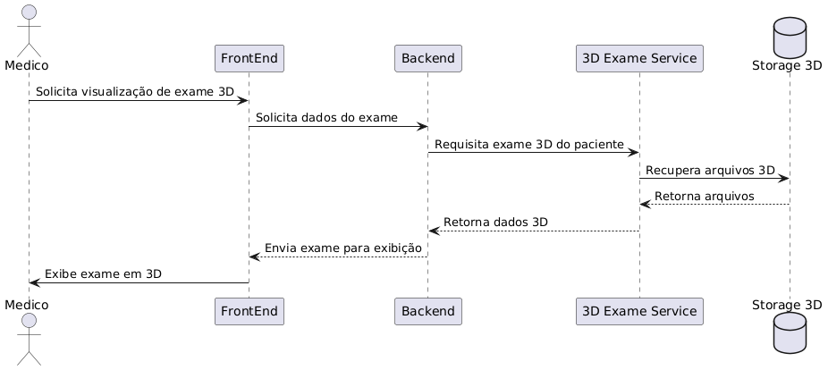
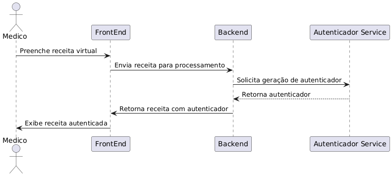
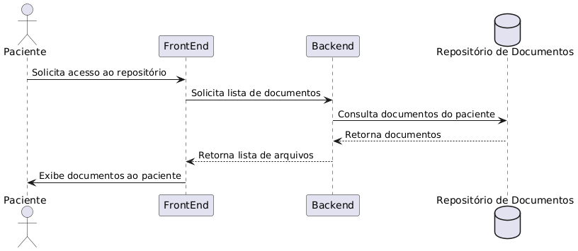
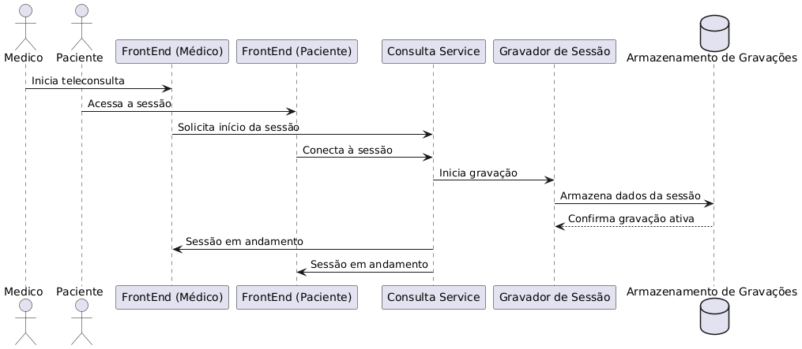
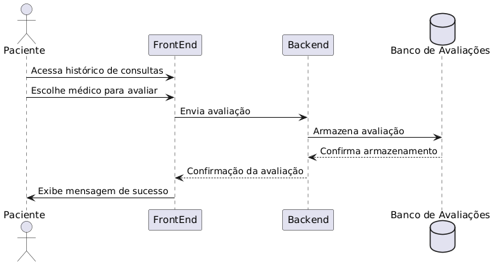

# **Sistema de Consultas Médicas com Realidade Virtual Aumentada**

# Visão arquitetural
Nessa iteração foram adicionados serviços de consultas as auditorias de gravações feitas em banco de dados não relacional MongoDB e serviçode autenticador com LibreSign. Além disso, criou-se o repositório de documentos no S3.

# Visão de Segurança
### Segurança na Arquitetura de Microsserviços (Backend)

- Serviço de Autenticação:
Verificação JWT/OAuth2 em todas as requisições com Auth Gateway e uso de Rate Limiting para prevenir contra invasões de autenticação DDoS/brute force. Dessa maneira, garantimos que somente o médico acessa a sua conta no sistema e seu autenticador de documentos.

- Autenticador de documentos médicos:
Para garantir a segurança e anti-fraude de documentos médicoso sistema vai usar a  Assinatura Digital com Certificado ICP-Brasil para autenticar documentos, usando a biblioteca LibreSign, que é compatível com o ICP.

    Esse tipo de assinatura tem validade jurídica na Lei 14.063/2020 para prescrições digitais, sendo muito seguro para este domínio da saúde.

- Repositório de documentos:
Seguir o princípio da LGPD Compliance e Armazenar documentos médicos e dados sensíveis, como exames e laudos, usando a criptografia em repouso com AES-256 dos buckets S3 da AWS. 

- Serviço de Consultas
Gravar vídeos de teleconsultas protegidos mesmo em cloud e construir banco dedicado de avaliações de pacientes para evitar vazamento cruzado.

# Visão de Interação
## Diagrama de casos de uso

## Diagramas de sequência
### RF06 - O sistema deve permitir que o médico visualize imagens e vídeos de exames médicos em 3D durante a consulta.

### RF07 - O sistema deve ser capaz de gerar um autenticador para as receitas virtuais.

### RF08 - O paciente deve ter acesso a um repositório, dentro da plataforma, com seus laudos, prescrições, exames e orientações recebidas nas consultas.

### RF09 - As teleconsultas devem ser gravadas para auditorias, em casos de suspeitas de negligência médica.

### RF010 - O sistema deve permitir que o paciente avalie o médico que o atendeu.

