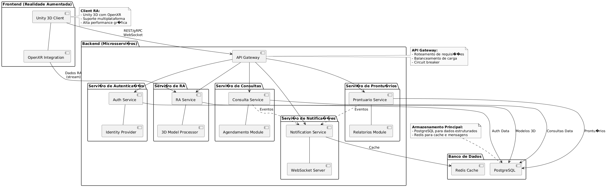
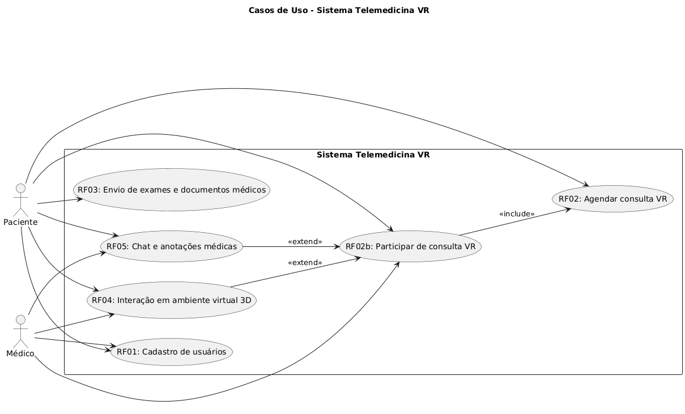
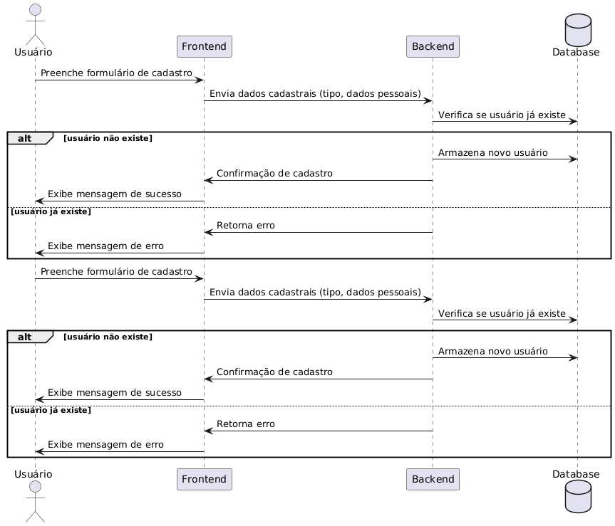
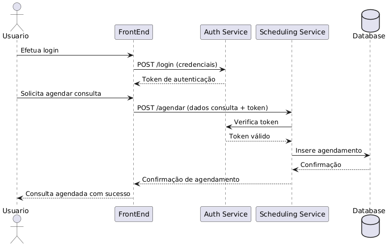
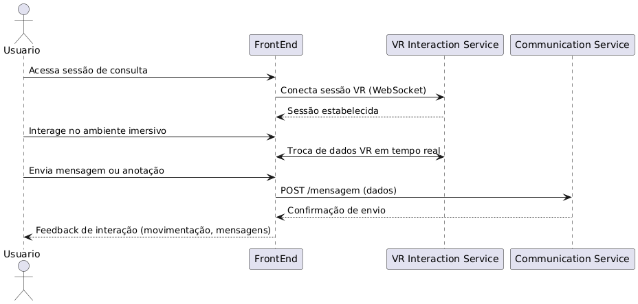
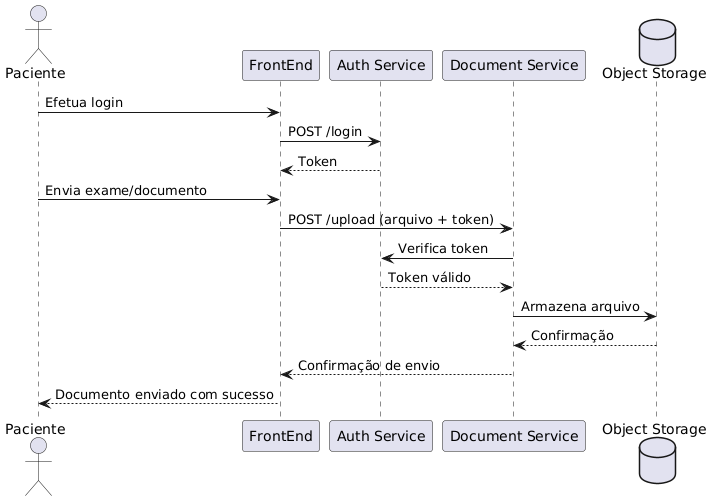
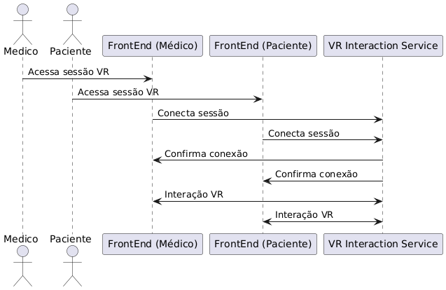
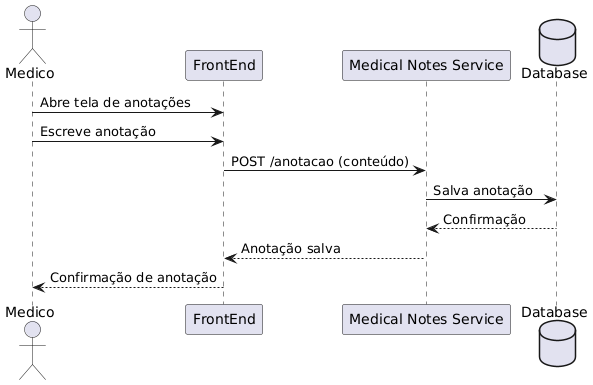
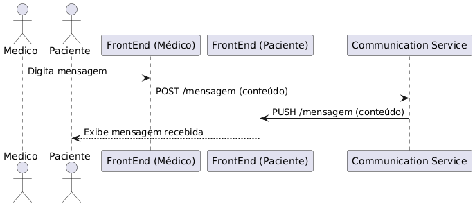

# Visão geral da arquitetura do sistema

**Sistema de Consultas Médicas com Realidade Virtual Aumentada**

## Estilo arquitetural adotado:

O estilo arquitetural adotado para o back-end será **Microsserviços**, abordagem que permite a entrega rápida e aplicativos grandes e complexos, uma vez que divide o sistema em vários serviços, os quais podem ser implementados de forma independente e que secomunicam por meio de APIs.

Justificativas técnicas para a utilização de Microsserviços:
- **Escalabilidade independente:** diferentes funcionalidades do sistema terão cargas variáveis. Por exemplo, o serviço de consultas em tempo real, usado pela RA, demanda alta performance gráfica e baixa latência, enquanto o serviço de agendamento de consultas e exames tem picos em horários específicos. Nesse sentido, cada microsserviço pode ser escalado de acordo com sua demanda específica e pode-se evitar desperdício de recursos computacionais;
- **Disponibilidade e Tolerância a falhas:** como os serviços são independentes, caso ocorra a falha em um serviço, os outros não serão afetados. Essa característica é fundamental para a disponibilidade do sistema, uma vez que, caso haja uma falha, não ocorrerá de o sistema inteiro ser derrubado; 
- **Flexibilidade tecnológica:** como utilizaremos RA na aplicação, porém necessitamos de um back-end eficiente e confiável, a utilização de microsserviços nos permite adaptar a stack conforme nossas necessidades, já que cada serviço pode ser desenvolvido na linguagem ou tecnologia mais adequada;
- **Performance otimizada para RA:** a Realidade Aumentada exige baixa latência e sincronização precisa entre múltiplos usuários. Microsserviços são naturalmente distribuídos e suportam comunicação síncrona e assíncrona. Assim, podemos garantir performance e escalabilidade para o sistema;
- **Manutenção e evolução contínuas:** Serviços podem ser desenvolvidos e testados de maneira independente, o que reduz o risco de alterações em um módulo afetarem todo o sistema. Dessa forma, a correção ou introdução de funcionalidades torna-se mais eficiente;
- **Segurança granular:** como o sistema trabalha com dados sensíveis, é necessário auditoria granular (por exemplo, caso um usuário acesse um prontuário), e criptografia em trânsito e em repouso. A arquitetura escolhida permite controles de seguranças específicos por serviço, o que é importante para a LGPD e para regulamentações de saúde. 

Quanto ao front-end com RA, as tecnologias escolhidas foram Unity com OpenXR, considerando questões como curva de aprendizado, custo e robustez da aplicação. O Unity é plataforma líder em desenvolvimento 3D e RA, e com suporte a múltiplos dispositivos e alta performance gráfica, enquanto OpenXR é um padrão aberto e livre de royalties desenvolvido pela Khronos que visa simplificar o desenvolvimento de RA/RV.

Justificativas técnicas para a utilização de Unity + OpenXR:
- Alta performance gráfica, essencial para modelos anatômicos, exames 3D, ou simulações médicas.
- Suporte a múltiplas plataformas.
- Permite interfaces naturais: interação via gestos, voz, dispositivos de controle ou touch 3D.
- Compatível com dispositivos como webcams, câmeras 3D ou sensores específicos.
- Integração Fácil com Backend via REST, WebSocket e gRPC conexão com microsserviços.

## Resumo da stack tecnológica:

- Unity 3D (C#):	Motor gráfico para interface 3D/RA desktop com alta performance.
- OpenXR:	Padrão aberto para integração de dispositivos RA/XR.
- WebSocket / REST / gRPC:	Comunicação com o backend em tempo real ou via APIs.
- Microsserviços:	Java (Spring Boot).
- Banco de dados relacional: PostgreSQL.

# Visão de Interação
## Diagrama de casos de uso

## Diagramas de sequência
### RF01 - O sistema deve permitir o cadastro de usuários, que podem ser médicos ou pacientes.

### RF02 - O usuário deve ser capaz de agendar e participar de consultas médicas remotas utilizando realidade virtual, interagindo com o profissional de saúde em um ambiente imersivo.

### RF03 - O sistema deve permitir que o paciente envie exames e documentos médicos antes da consulta para análise do médico.

### RF04 - O sistema deve permitir que médicos e pacientes interajam em um ambiente virtual 3D, simulando uma consulta presencial.

### RF05 - O sistema deve oferecer funcionalidades de chat e anotações médicas

# Visão de Segurança
### Segurança na Arquitetura de Microsserviços (Backend)

- Autenticação e Autorização:
Implementação de autenticação robusta baseada em JWT (JSON Web Token), OAuth2 ou OpenID Connect, garantindo que apenas usuários autorizados acessem os serviços. Controle de permissões específicas para médicos, pacientes e administradores.

- Zero Trust:
Cada microsserviço verifica a identidade e autorização de quem faz a chamada, independentemente de estar dentro da rede interna. Não há confiança implícita entre serviços.

- Criptografia de Dados:
Todos os dados trafegam de forma segura, utilizando TLS/SSL. Além disso, dados sensíveis armazenados, como prontuários médicos, exames e informações pessoais, são protegidos com criptografia em repouso, utilizando algoritmos fortes (ex.: AES-256).

- Isolamento de Dados:
Cada microsserviço acessa apenas os dados necessários para sua operação. Por exemplo, o serviço de chat não acessa informações de documentos médicos.

- Auditoria e Rastreamento:
Todos os acessos e alterações em dados sensíveis são auditados e armazenados em logs protegidos, possibilitando rastrear qualquer atividade suspeita ou incidente de segurança.

### Segurança no Frontend com Unity + OpenXR
- Toda a comunicação entre o cliente Unity e os microsserviços ocorre por meio de conexões seguras (HTTPS, WSS ou gRPC com TLS).

- Proteção contra Engenharia Reversa:
O aplicativo Unity será ofuscado e terá proteções contra engenharia reversa, dificultando que atacantes tentem extrair informações sensíveis ou manipular o comportamento do cliente.