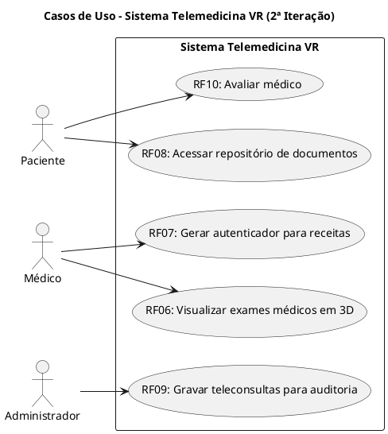

### 2° Iteração

- RF06 - O sistema deve permitir que o médico visualize imagens e vídeos de exames médicos em 3D durante a consulta.
- RF07 - O sistema deve ser capaz de gerar um autenticador para as receitas virtuais.
- RF08 - O paciente deve ter acesso a um repositório, dentro da plataforma, com seus laudos, prescrições, exames e orientações recebidas nas consultas.
- RF09 - As teleconsultas devem ser gravadas para auditorias, em casos de suspeitas de negligência médica.
- RF10 - O sistema deve permitir que o paciente avalie o médico que o atendeu.

## 4. Diagrama de Casos de Uso - 2ª Iteração

O diagrama de casos de uso abaixo foi elaborado com PlantUML, com base nos requisitos RF06–RF10.  
Você pode editar este bloco diretamente ou abrir o arquivo externo `casos-de-uso-2a-iteracao.puml` (via VSCode ou visualizador online).

